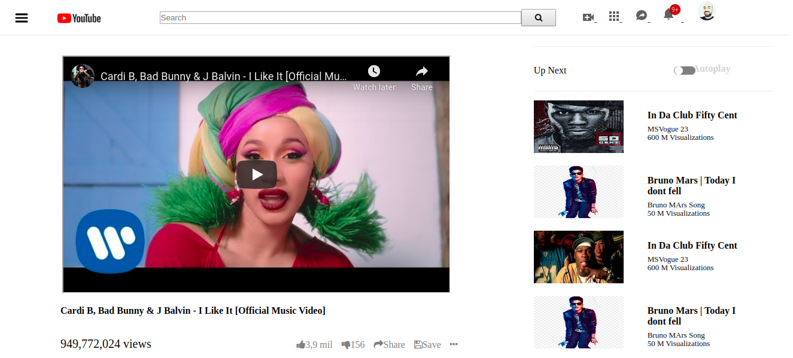

## Project: Basic HTML - Youtube 
  
This collaborative project is based on the youtube.com video page, as a part of the assignment for microverse using concepts of html and css, to create the video page.

## Built With

- HTML5
- CSS3

## Authors

👤 **Antonio Fernandes**

- Github: [@github/trox115](https://github.com/trox115)

👤 **Gonza Javier Mancilla**

- Github: [@github/gonjavi](https://github.com/gonjavi)
- Linkedin: [linkedin](https://www.linkedin.com/in/g-javier-mancilla-a686a9178/)

## Live Demo

[Live Demo Link](https://gonjavi.github.io/BasicHTML/)

## 🤝 Contributing

Contributions, issues and feature requests are welcome!

## Show your support

Give a ⭐️ if you like this project!

## 📝 License

This project is [MIT](lic.url) licensed.

